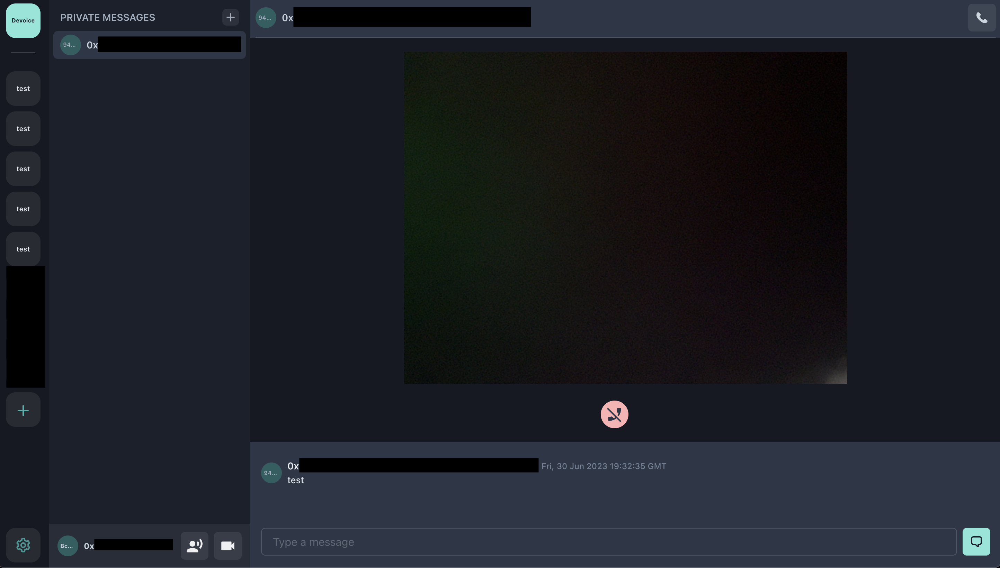
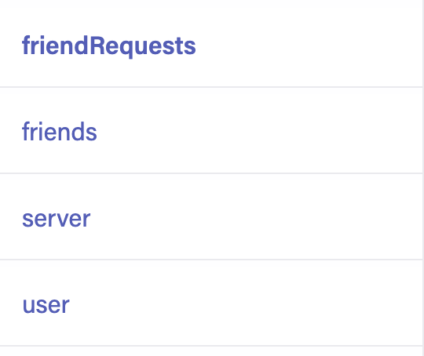

# Devoice - The dApp alternative to Discord

https://devoice.netlify.app/

:warning: The project is in early stage, it just started a few days ago and is not production ready at all.



## Getting Started

First, copy the `env.sample` and fill the keys you need (Fauna and Huddle01 keys are needed).

Then you'll have to create a few collection on Fauna:



And a few indexes:

`friendsAddress` indexed data.owner
`getFriendsByFrom` indexed on data.from
`getFriendsByTo`indexed on data.to
`joinedServers` indexed on data.members
`serverId` indexed by data.id
`userAddress` indexed by data.address

Then run the development server:

```bash
npm i && npm run dev
```

## The project

You will be able to create some servers, invite some friends, at the first use, the project will be fully centralized on Fauna or another database.

The project uses XMTP to deliver instant messaging features on private messages of your friends or on server's channels.

The project uses Huddle01 to deliver the Video/Audio features of meetings and calls with private friends or server's channels.

### Decentralized

The goal would be to compare the updatedAt dates of the servers and friends with a smartcontract, and be able to detect out of sync datas, and then to be able to push it into the smart contracts and store datas on IPFS
